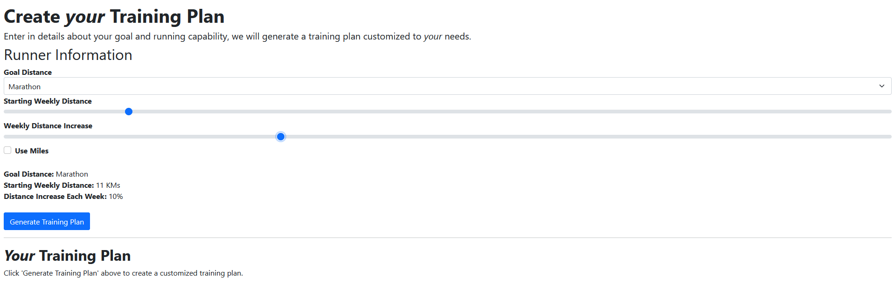
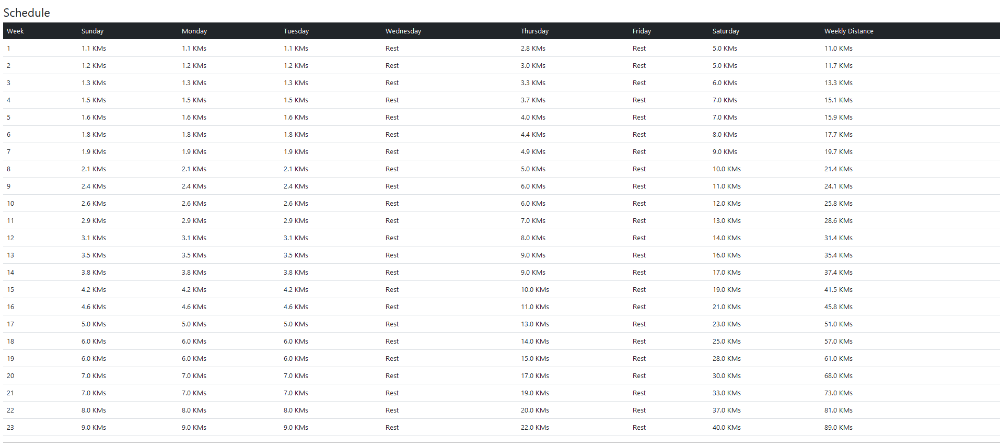

# Dynamic Running Plan Generator

This is a full-stack running training plan generator. It takes information about the user's goal and running capability and dynamically generates a training plan customized to the skill level of the runner. It lists out the training plan as a schedule and visualizes it with a graph.

## Technologies Used

- Spring Boot
- React (Create React App)
- Java
- JavaScript
- HTML
- Bootstrap 5
- Chart.js
- Axios
- Maven

## To Run

1.  Start up back-end:

>> `cd marathon-planner`

>> `mvn spring-boot:run`

2. Start up front-end:

>> `npm start`

## Credits

### Chart.js Functionality
- https://blog.logrocket.com/using-chart-js-react/

## Images

### *Runner fills in their information, and then clicks on 'Generate Training Plan'*

### *A Training Plan is Dynamically Generated in the Back End, and Listed in the UI as Table*

### *A Graph is Shown of the Entire Training Plan*

